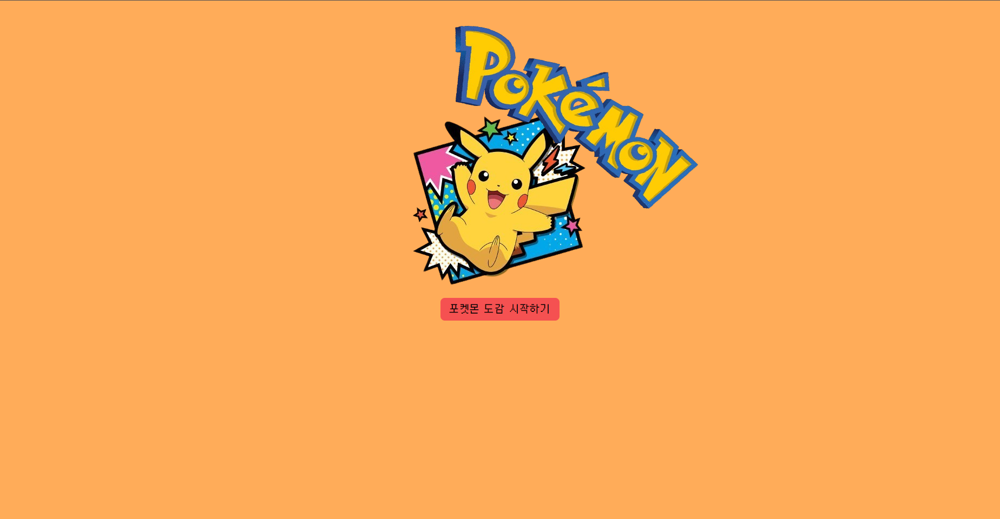

# 🎉 1세대 푸키먼 도감



# 🔖 프로젝트 개요

브랜치의 사용방법 익히면서 React의 Router와 context APi, RTK를 익히기 위한 프로젝트

# 🔨 기술 스택

- React.js
- React-Router-Dom
- Styled-Components
- Redux ToolKit
- sweetalert2

# ✅ 구현 사항

- [x] Git branch 사용하여 prop-drilling, context, RTK branch 별로 작업.
- [x] react-router-dom을 이용하여 페이지간 이동을 구현.
- [x] Mock_DATA를 바탕으로 페이지 구현 및 추가, 삭제 기능 구현
- [x] queryString으로 받아온 값을 바탕으로 상세페이지 구현 및 뒤로가기 구현
- [x] 유효성 검사(중복 선택 방지, 선택 수 제한) 알림 구현
- [x] styled-componenets를 사용하여 전반적인 스타일 설정
- [x] Redux ToolKit으로 리팩터링
- [x] Detail 페이지에서 삭제버튼 추가
- [x] LocalStorage를 사용하여 데이터 유지
- [x] sweetalert2를 사용하여 세련된 UI 제공

# 🚨 트러블 슈팅

- [버튼에 이벤트가 있는데 왜 다른 이벤트가 먹음?](https://velog.io/@wltn7star/TIL19.-%EC%9E%90%EB%B0%94%EC%8A%A4%ED%81%AC%EB%A6%BD%ED%8A%B8-some-%EC%82%AC%EC%9A%A9)
- [빈 포켓볼 만들고 싶은데 어떻게 만들지?](https://velog.io/@wltn7star/TIL19.-%EC%9E%90%EB%B0%94%EC%8A%A4%ED%81%AC%EB%A6%BD%ED%8A%B8-some-%EC%82%AC%EC%9A%A9)
- [vercel로 배포했는데 이미지는 어디감?](https://velog.io/@wltn7star/TIL19.-%EC%9E%90%EB%B0%94%EC%8A%A4%ED%81%AC%EB%A6%BD%ED%8A%B8-some-%EC%82%AC%EC%9A%A9)

# 📸 스크린 샷

<details>
  <summary>홈 화면</summary>


)

</details>
<details>
  <summary>도감 화면</summary>


)

</details>
<details>
  <summary>상세 페이지</summary>


)

</details>

# 📦 프로젝트 구조

```
📦Pokemon-Dex
 ┣ 📂public
 ┃ ┣ 📂fonts
 ┃ ┃ ┣ 📜pixelroborobo.otf
 ┃ ┃ ┗ 📜Silver.ttf
 ┃ ┣ 📜homepikachu.png
 ┃ ┣ 📜pikachu.png
 ┃ ┣ 📜pokemon-logo.png
 ┃ ┣ 📜poketball.png
 ┃ ┗ 📜poketball_glossy.png
 ┣ 📂src
 ┃ ┣ 📂assets
 ┃ ┣ 📂components
 ┃ ┃ ┣ 📜Dashboard.jsx
 ┃ ┃ ┣ 📜PokemonCard.jsx
 ┃ ┃ ┣ 📜PokemonDetail.jsx
 ┃ ┃ ┗ 📜PokemonList.jsx
 ┃ ┣ 📂data
 ┃ ┃ ┣ 📜MOCK_DATA.js
 ┃ ┃ ┗ 📜TypeColor.js
 ┃ ┣ 📂pages
 ┃ ┃ ┣ 📜Dex.jsx
 ┃ ┃ ┗ 📜Home.jsx
 ┃ ┣ 📂redux
 ┃ ┃ ┣ 📂config
 ┃ ┃ ┃ ┗ 📜configSlice.js
 ┃ ┃ ┗ 📂slices
 ┃ ┃ ┃ ┗ 📜pokemonSlice.js
 ┃ ┣ 📂shared
 ┃ ┃ ┗ 📜Router.jsx
 ┃ ┣ 📂styles
 ┃ ┃ ┗ 📜reset.css
 ┃ ┣ 📂utils
 ┃ ┃ ┣ 📜localStorage.js
 ┃ ┃ ┣ 📜swalModal.js
 ┃ ┃ ┗ 📜useCardManager.js
 ┃ ┣ 📜App.jsx
 ┃ ┗ 📜main.jsx
 ┣ 📜.gitignore
 ┣ 📜eslint.config.js
 ┣ 📜index.html
 ┣ 📜LICENSE
 ┣ 📜package-lock.json
 ┣ 📜package.json
 ┣ 📜README.md
 ┗ 📜vite.config.js
```
